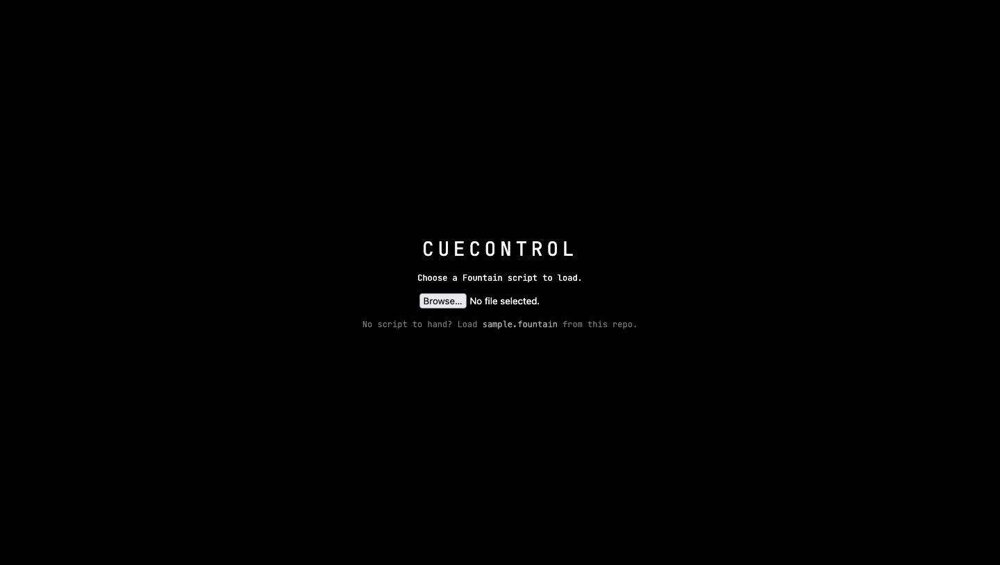

```
 ██████╗ ██╗   ██╗ ███████╗
██╔════╝ ██║   ██║ ██╔════╝
██║      ██║   ██║ █████╗
██║      ██║   ██║ ██╔══╝
╚██████╗ ╚██████╔╝ ███████╗
 ╚═════╝  ╚═════╝  ╚══════╝
 ██████╗  ██████╗  ███╗   ██╗ ████████╗ ██████╗   ██████╗  ██╗
██╔════╝ ██╔═══██╗ ████╗  ██║ ╚══██╔══╝ ██╔══██╗ ██╔═══██╗ ██║
██║      ██║   ██║ ██╔██╗ ██║    ██║    ██████╔╝ ██║   ██║ ██║
██║      ██║   ██║ ██║╚██╗██║    ██║    ██╔══██╗ ██║   ██║ ██║
╚██████╗ ╚██████╔╝ ██║ ╚████║    ██║    ██║  ██║ ╚██████╔╝ ███████╗
 ╚═════╝  ╚═════╝  ╚═╝  ╚═══╝    ╚═╝    ╚═╝  ╚═╝  ╚═════╝  ╚══════╝
```

A prompt book for stage managers. Load a script in Fountain, follow it live on a
panel of tiles, and mark the words your cues are called on.

> [!WARNING]
> I built this over a weekend at HackLondon 2025 and then abandoned it. Until
> September 2026 it didn't run at all: it fetched the script from a server I
> never wrote, so every load ended in the error handler. I've fixed that much, so
> you can see what it does, but the cue prompting is broken and saving corrupts
> your script. Read [Known issues](#-known-issues) before you point it at
> anything you care about. I'm rewriting it rather than patching it, and the
> design for that is in [docs/SPEC.md](docs/SPEC.md).

<div align="center">


</div>

## 🎭 About

A stage manager calls a show from a prompt book: a copy of the script marked with
every cue, showing which word each one lands on. They read ahead, give each
department a standby, then call the go on the beat. I wanted that book on a
screen, with the cues able to leave the machine and reach a lighting desk.

What exists is the reading half. You load a Fountain script, drop tiles onto a
4x3 grid, and follow the script line by line with the spacebar while a clock
runs. The sending half never got written, and the cue prompting that was supposed
to connect the two doesn't work.

- Parses Fountain into scene headings, characters, dialogue, parentheticals, lyrics, transitions and centered text
- Follows the script line by line, keeping the current line centered in its tile
- Places cue marks on a line and stores them as JSON inside Fountain boneyard comments, so the marks travel inside the script file
- Records how long you spend on each line, so a rehearsal can time itself
- Lays tiles out on a grid you build by right-clicking a cell
- Shows a webcam feed and a microphone level meter as tiles
- Runs with no dependencies, no build step and no framework

## 🛠 Tech stack

| Layer | Technology | Why it's here |
|---|---|---|
| Markup | HTML5 | One page. The grid and the tooltip are the only fixed elements. |
| Styling | CSS custom properties | `--grid-columns` and `--grid-rows` are read from CSS by JavaScript, so the grid size lives in one place. |
| Logic | JavaScript, ES modules | Native `import` with no bundler. It's why the app needs a server rather than opening from disk. |
| Script format | Fountain | Plain text screenplay markup. Annotations hide in boneyard comments, so a marked script stays a valid script. |
| Camera and mic | MediaDevices, Web Audio, Canvas | The live feed and the level meter, both straight off the platform APIs. |
| Typeface | JetBrains Mono | Loaded from Google Fonts. Cue positions are measured by character width, which assumes a monospaced face. |

## 📷 Screenshots



The start screen I added in 2026. Before this, the app called `fetch` against
`localhost:3000` and you got a red error string instead of anything else.


Right-clicking a grid cell opens the tile menu. Each tile type disappears from
the menu once one is placed, so you get one of each. Note that the grid cells
have no visible borders, which is a bug rather than a look: the border color is
set to black on a black background.


A 2x3 Script Follow tile with a Timer Display beside it. The highlighted line is
the current one, and every press of space moves it down and scrolls the script to
keep it centered. The clock reads 00:00:03:650 here, which is already less than
the time that actually passed.

## 🚀 Getting started

### Prerequisites

- A browser with ES module support. Any current Chrome, Firefox, Safari or Edge.
- Python 3, which ships with macOS and most Linux distributions, to serve the files. Any static file server does the same job.
- A script in Fountain format. There's one at `sample.fountain` in this repo if you don't have one to hand.

You don't need npm. There's a `package.json` but it contains `{}` and declares
nothing, so `npm install` has nothing to install and `npm test` has no script to
run. It's a leftover from an IntelliJ project template.

### Installation

There's no install step. Clone it and serve it.

```bash
git clone https://github.com/saturncity/cuecontrol.git
cd cuecontrol
```

### Running

```bash
python3 -m http.server 8080
```

Open http://localhost:8080 and choose a Fountain file when the start screen asks
for one.

Serve it over HTTP rather than opening `index.html` from disk. Browsers refuse to
load ES modules over `file://`, so a double-click gives you a blank page and a
CORS error in the console.

### Using it

| Key | What it does |
|---|---|
| <kbd>Space</kbd> | Advance one line. Also starts the clock, the first time you press it after placing a Timer tile. |
| <kbd>↑</kbd> <kbd>↓</kbd> | Move up and down the script without advancing the press count |
| <kbd>P</kbd> | Pause and resume the clock |
| <kbd>R</kbd> | Reset everything back to the top |
| <kbd>U</kbd> | Toggle record mode, which times how long you hold each line |
| Right-click | Open the tile menu on a cell, or the delete menu on a tile |

Click a word on the highlighted line to drop a cue on it and give it a label.

## 📁 Project structure

```
cuecontrol/
├── index.html            # The whole page: grid wrapper, module layer, tooltip
├── script.js             # Entry point. Loads a script, then hands off to grid.js
├── sample.fountain       # A short scene to load if you don't have a script
├── css/
│   ├── grid.css          # Grid dimensions as custom properties, plus the start screen
│   ├── modules.css       # Tile chrome and the Fountain element styles
│   └── tooltip.css       # The right-click menu
├── js/
│   ├── grid.js           # Builds the grid, places and deletes tiles
│   ├── fountainParser.js # Fountain text into typed tokens
│   ├── scriptFollow.js   # The book: rendering, selection, cue placement, keys
│   ├── annotationManager.js # Reads and writes the hidden boneyard JSON per line
│   ├── fileManager.js    # File picker in, download out
│   ├── timerDisplay.js   # The clock
│   ├── promptDisplay.js  # Cue prompts. Broken, see Known issues
│   ├── cueListDisplay.js # Cue synopsis. Never ran, see Known issues
│   ├── liveFeed.js       # Webcam tile
│   └── audioLevelMonitor.js # Microphone level tile
└── docs/
    ├── SPEC.md           # The v2 design, agreed and not yet built
    └── assets/           # Screenshots for this README
```

## 🐛 Known issues

I'm not fixing these on this branch. The v2 rewrite in
[docs/SPEC.md](docs/SPEC.md) addresses all of them, and patching a weekend
prototype into a tool a stage manager could trust isn't worth the diff.

**Cue prompting shows the wrong line.** `promptDisplay` reads
`window.currentSelectIndex`, which counts selectable lines, and looks it up as
though it counted every line in the script. Those numbers diverge as soon as
there's a scene heading or a character name, so the tile shows a line you aren't
on. It also renders once when you place it and never updates, so it's frozen on
whatever line was current at the time. This is the feature the project is named
for.

**Saving corrupts your script.** Turning record mode off posts the script back to
the server that doesn't exist, so nothing is written today. The bug is what it
would write if it could: the exporter rebuilds the file from rendered text, which
drops the `.` on forced scene headings, the `~` on lyrics, the `@` on forced
characters, the `> <` on centered text, and the whole title page. Round-tripping
a marked script through it would quietly flatten the formatting.

**The clock runs slow.** It adds exactly 10ms on every `setInterval(fn, 10)`
tick, and browsers don't fire a 10ms interval on time. I measured 14.5% slow in
headless Firefox, which is about 17 minutes lost over a two-hour act. The
mechanism guarantees it runs slow on any browser, though the size of the gap
moves with the machine.

**Cue marks land on the wrong character.** Cue positions are worked out by
measuring one character's width and dividing the click offset by it. That ignores
the left margin on dialogue and parentheticals, and it ignores wrapping entirely,
so on any line that runs to a second row the mark lands somewhere else. Resizing
a tile moves every mark, because the stored offset was measured against the old
width.

**Forced scene headings only work once.** The parser latches a flag after the
first scene heading, and after that a `.SCENE NAME` line falls through to the
all-caps test and becomes a character name. My own `sample.fountain` has this
problem: the second act heading renders as a character.

**Keys collide and stack.** `R` is bound in both `scriptFollow.js` and
`timerDisplay.js`, and which one wins depends on the order you placed the tiles.
Each Script Follow tile you add registers another window listener, so with two of
them every press fires twice. Nothing checks whether you're typing in a field.
`R` also wipes the clock with no confirmation.

**The clock starts late.** `timerDisplay` registers its space handler when you
place the tile, so the clock starts on the first press after that. Add the timer
once you've started following the script and it starts from zero without saying
so.

**Tiles leak when you delete them.** The webcam tile never stops its stream, so
the camera light stays on until you close the tab. The audio tile keeps its
`requestAnimationFrame` loop running forever against a canvas that's no longer on
the page, and never closes its `AudioContext`. Deleted timer tiles stay in the
array the clock updates.

**The grid is invisible.** Cell borders are `1px solid black` on a black
background, so you see a field of `+` signs and no cells. Worth knowing before
you decide the layout is broken.

**Script text goes through `innerHTML`.** A script containing `<` or `&` renders
as markup instead of text.

**The cue list tile has never run.** `cueListDisplay.js` imports
`./totalTime.js`, which isn't in the repo. Nothing imports the tile, so it sits
there inert rather than breaking anything.

**Tiles can't be moved or resized** once placed, and the layout isn't saved. Two
of the tile types differ only in size and both create an element with the same
`id`, so placing both gives you duplicate IDs.

## 🤝 Contributing

This branch is an archive, so I'd rather not take patches against it. If you want
to work on CueControl, the v2 design in [docs/SPEC.md](docs/SPEC.md) is where
it's going, and issues and disagreements about that are welcome. The prototype as
it was at HackLondon, before I made it boot, is on the
[`v1`](https://github.com/saturncity/cuecontrol/tree/v1) branch.

## 📄 License

MIT. See [LICENSE](LICENSE).
