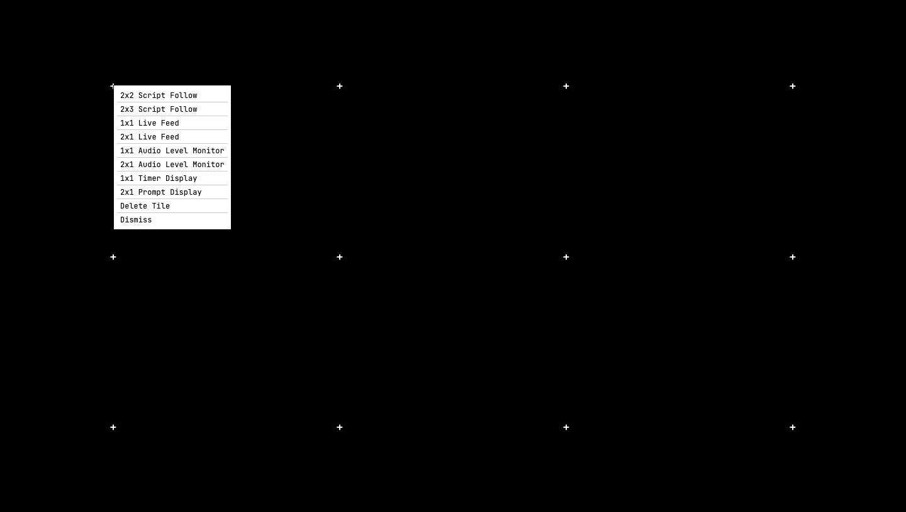
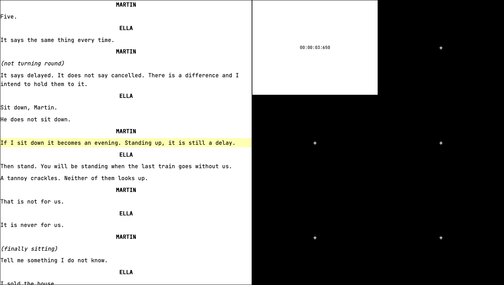

```
 ██████╗ ██╗   ██╗ ███████╗
██╔════╝ ██║   ██║ ██╔════╝
██║      ██║   ██║ █████╗
██║      ██║   ██║ ██╔══╝
╚██████╗ ╚██████╔╝ ███████╗
 ╚═════╝  ╚═════╝  ╚══════╝
 ██████╗  ██████╗  ███╗   ██╗ ████████╗ ██████╗   ██████╗  ██╗
██╔════╝ ██╔═══██╗ ████╗  ██║ ╚══██╔══╝ ██╔══██╗ ██╔═══██╗ ██║
██║      ██║   ██║ ██╔██╗ ██║    ██║    ██████╔╝ ██║   ██║ ██║
██║      ██║   ██║ ██║╚██╗██║    ██║    ██╔══██╗ ██║   ██║ ██║
╚██████╗ ╚██████╔╝ ██║ ╚████║    ██║    ██║  ██║ ╚██████╔╝ ███████╗
 ╚═════╝  ╚═════╝  ╚═╝  ╚═══╝    ╚═╝    ╚═╝  ╚═╝  ╚═════╝  ╚══════╝
```

A cue-calling prompt book for stage managers. Mark cues on the words they're
called on, then call the show and let lighting and sound receive the GO over MIDI
Show Control and OSC.

> [!NOTE]
> The v2 design is agreed and written up in [docs/SPEC.md](docs/SPEC.md). None of
> it is built yet. The code on this branch is still the 2025 hackathon prototype,
> unchanged except for the commit that made it boot, so treat anything you run
> today as the old version. The [Roadmap](#-roadmap) is the honest picture.

<div align="center">


</div>

## 🎭 What it is

A stage manager calls a show from a prompt book: a copy of the script marked with
every cue, showing which word each one lands on. They read ahead, give each
department a standby, then call the go on the beat.

Doing that on paper costs three jobs at once. You read the book, you speak the
cue over headset, and you keep a stopwatch running so you can write act running
times on the show report. Existing software splits the problem badly: playback
software owns the cues but has no idea where they sit in the script, and script
software owns the script but can't fire anything. The stage manager ends up as
the integration layer, retyping cue numbers into a second system.

CueControl is both halves. Load a script in Fountain, click the word a cue is
called on, label it the way you'd write it in a real book. The mark lives inside
the script file, so the book and the script are one document. During the show,
one key is GO.

## 📍 Where it is

| Piece | State |
|---|---|
| v2 design | Agreed, in [docs/SPEC.md](docs/SPEC.md) |
| v2 code | Not started |
| Test seam | Decided: one pure show core, driven with `node --test` |
| Prototype | Runs, with [known defects](https://github.com/saturncity/cuecontrol/tree/v1#-known-issues) |

I built the prototype over a weekend at HackLondon 2025 and abandoned it. It
didn't run at all until September 2026: it fetched the script from a server I
never wrote, so every load ended in the error handler. I've fixed that much, and
the version that exists today is archived on the
[`v1`](https://github.com/saturncity/cuecontrol/tree/v1) branch.

I'm rebuilding rather than patching. Reading the prototype back turned up
nineteen defects, and the three that matter most are structural: the cue prompt
tile reads the wrong line, exporting a marked script drops every Fountain syntax
marker, and the clock runs 14.5% slow because it adds a fixed 10ms per
`setInterval(10)` tick. That last one loses about 17 minutes over a two-hour act,
which is the number a stage manager writes on the show report.

## 🧭 Design

The whole design is in [docs/SPEC.md](docs/SPEC.md). The decisions that shape
everything else:

**One pure show core.** A single module owns the script tokens, the cue index,
the calling position and the clock, constructed with injected clock and send
ports. Every panel is a renderer over it. The prototype broke that three ways:
panels owned domain state, panels read each other's DOM, and shared state sat on
the global object.

**The project is one Fountain file.** Cues, layout, department config and
recorded timings live inside it as boneyard comments, which the Fountain spec
says every other tool ignores. Per-line data sits next to the line it annotates
so it survives a cut made in any editor. Show-level config goes in one header
block.

**Cues attach to words, not characters.** A word index survives reflow, resize
and indentation. The prototype stored a character offset measured with
`measureText`, which broke on every indented and every wrapped line.

**Both transports, one download.** A dependency-free Node file serves the app
from `localhost` and relays OSC over UDP. Serving from that origin also makes
`localhost` a secure context, so Web MIDI works, with no mixed content and no
private network preflight. Open it from anywhere else and you get the book with
OSC disabled and a reason.

**Red is standby, green is go, amber is warning.** Cue lights are physical
fixtures and those meanings are established for anyone who has worked backstage.
Record mode therefore can't use red and becomes a text label.

## 🛠 Tech stack

| Layer | Technology | Status |
|---|---|---|
| App | JavaScript, ES modules, no bundler | In use |
| Markup and styling | HTML5, CSS custom properties | In use |
| Script format | Fountain, with annotations in boneyard comments | In use |
| Camera | MediaDevices, for the stage view tile | In use |
| Bridge | Node 18 or later, `node:http` and `node:dgram`, no dependencies | Specified, not written |
| Cue transport | Web MIDI sending MSC, and OSC over the bridge | Specified, not written |
| Tests | `node --test` against the show core | Specified, not written |

## 📷 Screenshots

These are the prototype, not the rewrite.



Right-clicking a grid cell opens the tile menu. Each type disappears once one is
placed, so you get one of each. The cells have no visible borders because the
border color is set to black on a black background, which v2 fixes along with the
rest of the palette.



A Script Follow tile with a Timer Display beside it. The highlighted line is the
current one, and space moves it down while the script scrolls to keep it
centered. The clock reads 00:00:03:650, already behind the time that actually
passed.

## 🚀 Running what's here today

This runs the prototype. There's nothing of v2 to run yet.

### Prerequisites

- A browser with ES module support. Any current Chrome, Firefox, Safari or Edge.
- Python 3, which ships with macOS and most Linux distributions, to serve the files. Any static file server does the same job.
- A script in Fountain format. There's one at `sample.fountain` if you don't have one to hand.

No package manager is involved. No dependencies, no lockfile, nothing to install.

```bash
git clone https://github.com/saturncity/cuecontrol.git
cd cuecontrol
python3 -m http.server 8080
```

Open http://localhost:8080 and choose a Fountain file when the start screen asks
for one.

Serve it over HTTP rather than opening `index.html` from disk. Browsers refuse to
load ES modules over `file://`, so a double-click gives you a blank page and a
CORS error in the console.

## 🗺 Roadmap

Ordered roughly the way I'd build it. The round-trip test comes first because
it's the one that stops the tool eating someone's prompt book.

- [x] Agree the v2 design and write it up
- [x] Pick the test seam
- [ ] Show core, with injected clock and send ports
- [ ] Fountain parse and serialize that round-trips without dropping syntax
- [ ] Word-level cue placement
- [ ] Department table and cue label parsing, point cues included
- [ ] Warning, standby and go, with configurable lookahead
- [ ] Act running times from monotonic timestamps
- [ ] Auto-save, plus export and import
- [ ] Project launcher with recent shows
- [ ] Web MIDI sending MSC
- [ ] The OSC bridge, serving the app and relaying UDP
- [ ] Connection indicators and the cue log
- [ ] Dark console palette, self-hosted font

## 📁 Project structure

```
cuecontrol/
├── index.html            # The prototype's single page
├── script.js             # Entry point. Loads a script, hands off to grid.js
├── sample.fountain       # A short scene to load
├── css/                  # Grid, tile chrome and Fountain element styles
├── js/                   # The prototype's modules, one per tile plus the parser
├── docs/
│   ├── SPEC.md           # The agreed v2 design. Start here.
│   ├── agents/           # Per-repo config for the engineering skills
│   └── assets/           # Screenshots
└── .scratch/             # Issue tracker. One directory per feature.
```

## 🤝 Contributing

The design is settled but not sacred, and it's easier to change now than after
it's built. If something in [docs/SPEC.md](docs/SPEC.md) is wrong, open an issue
and say so. I'd rather hear it from someone who has called a show than argue it
from first principles.

Worth knowing before you read it: the terminology is deliberate. Standby and go
mean specific things, GO always comes last in a spoken cue, and point cues like
`LX 12.5` are ordinary rather than an edge case. The spec follows real practice
where that conflicts with what would be easier to build.

Tickets live in `.scratch/`, one directory per feature, per
[docs/agents/issue-tracker.md](docs/agents/issue-tracker.md).

## 📄 License

MIT. See [LICENSE](LICENSE).
